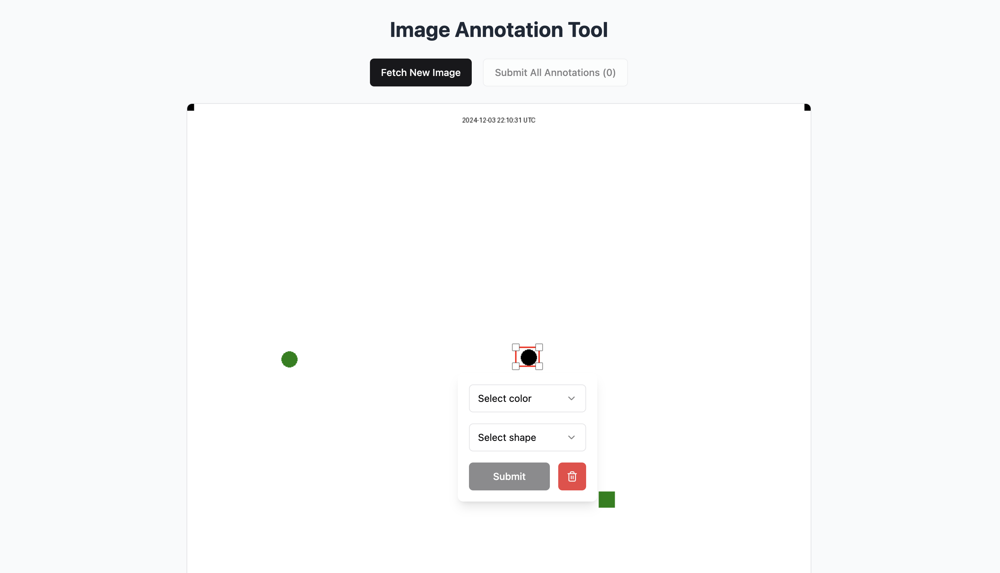

# Image Annotation Tool



The Image Annotation Tool is a web application that allows users to annotate images with various shapes and labels. This tool is useful for tasks such as labeling datasets for machine learning, creating visual notes, or any other purpose that requires image annotation.

## Features

- Fetch new images for annotation
- Annotate images with rectangles
- Save and manage annotations
- Responsive design for various screen sizes

## Installation

To run this project locally, follow these steps:

1. Clone the repository:

   ```sh
   git clone https://github.com/pranavgoel29/Image-Annotation-tool.git
   cd Image-Annotation-tool
   ```

2. Install dependencies:

   ```sh
   pnpm install
   ```

3. Start the development server:

   ```sh
   pnpm run dev
   ```

4. Open your browser and navigate to `http://localhost:5173`.

## Usage

1. Click on the `Fetch New Image` button to load a new image.
2. Use the annotation tool to draw rectangles on the image.
3. Save your annotations by clicking the `Submit` button.
4. Manage your annotations through the provided interface.
5. Submit annotations by clicking `Submit All Annotations`.

## Contributing

Contributions are welcome! Please follow these steps to contribute:

1. Fork the repository.
2. Create a new branch (`git checkout -b feature/your-feature`).
3. Commit your changes (`git commit -m 'Add some feature'`).
4. Push to the branch (`git push origin feature/your-feature`).
5. Open a pull request.
