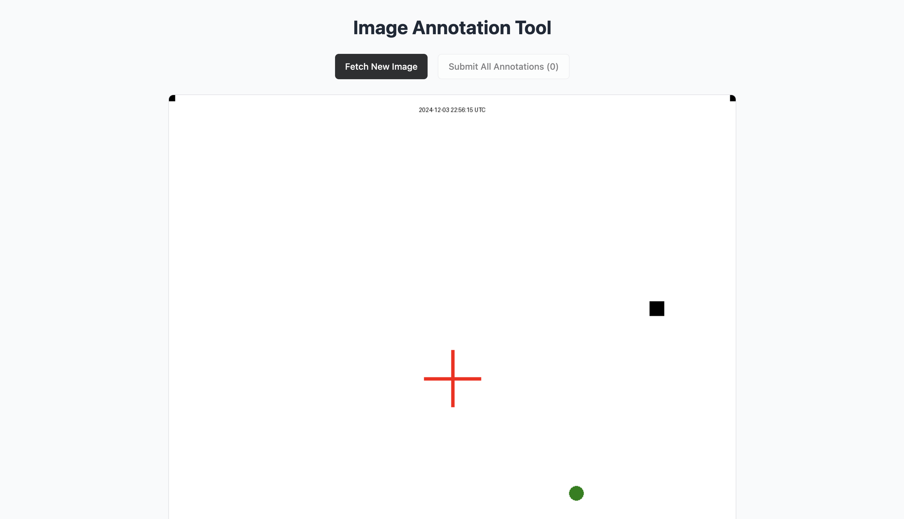
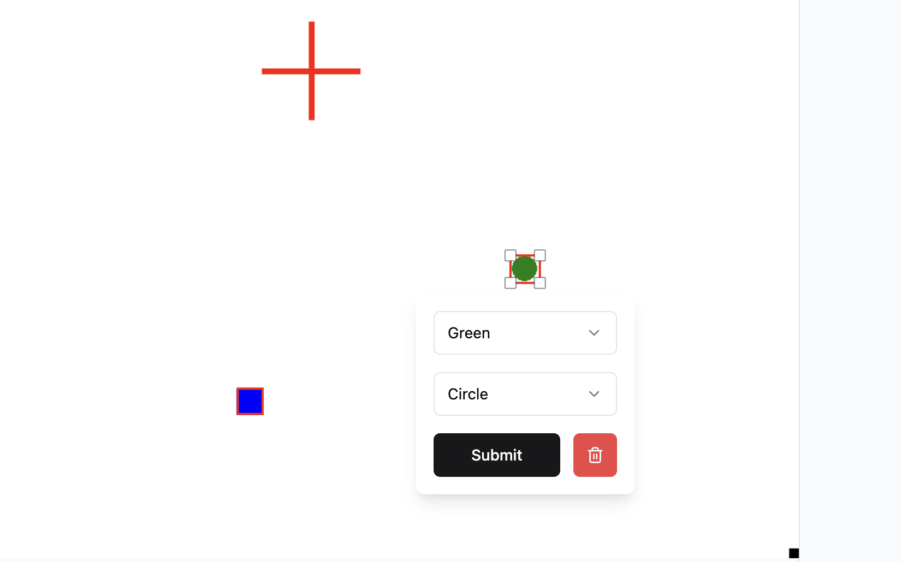
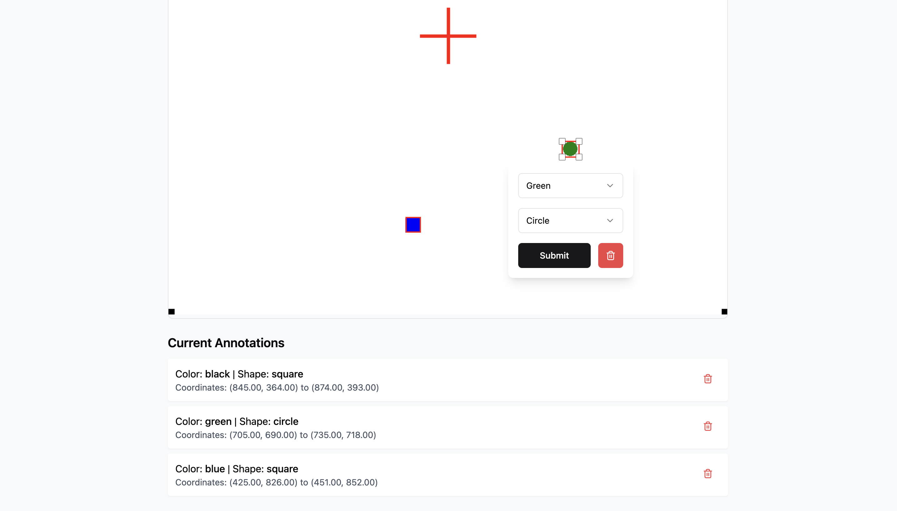
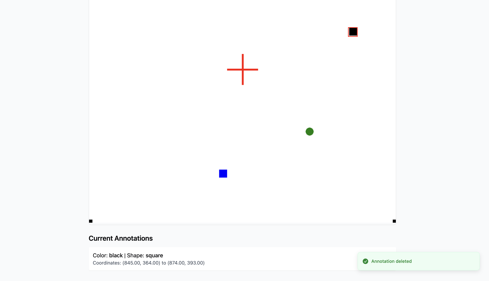

# Image Annotation Tool

The Image Annotation Tool is a web application that allows users to annotate images with various shapes and labels. This tool is useful for tasks such as labeling datasets for machine learning, creating visual notes, or any other purpose that requires image annotation.


## Features

- Fetch new images for annotation
- Annotate images with rectangles
- Save and manage annotations
- Responsive design for various screen sizes

<br>

## 📦 About Project

Tech Stack:

- React
- TypeScript
- Tailwind CSS
- Vite

Used [`annotorious`](https://annotorious.dev) for image annotation.

<br>

## Prerequisites

- Node.js (v18.12 or later)
- pnpm (v6 or later)

<br>

## Getting Started

1. Clone this repository to your local machine:

   ```bash
   git clone https://github.com/pranavgoel29/Image-Annotation-tool.git
   ```

2. Navigate to the project's directory:

   ```bash
   cd Image-Annotation-tool
   ```

3. Install dependencies using pnpm:
   ```bash
   pnpm install
   ```

<br>

## Running the App

To run the app in development mode, use the following command:

```bash
pnpm run dev
```

This command will start the Vite development server and compile your React app. Open your browser and navigate to `http://localhost:5173`.

<br>

## Usage

<blockquote><b><i>Click on the `Fetch New Image` button to load a new image.</i></b></blockquote>
   
   

<br>

<blockquote><b><i>Use the annotation tool to draw rectangles on the image.</i></b></blockquote>



<br>

<blockquote><b><i>Save your annotations by clicking the `Submit` button.</i></b></blockquote>



<br>

<blockquote><b><i>Manage your annotations through the provided interface.</i></b></blockquote>



<br>

<b>Submit annotations by clicking `Submit All Annotations`.</b>

<br>

## Future Goals

- Add support for more annotation shapes (e.g., circles, polygons)
- Add export functionality to download annotated images
- Improve the UI/UX for a better user experience

<br>

## 🐛 Bug Reporting

Feel free to [open an issue](https://github.com/pranavgoel29/Image-Annotation-tool/issues) on GitHub if you find any bug.
